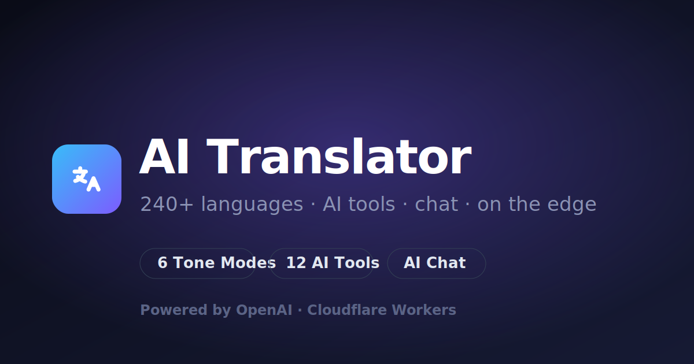
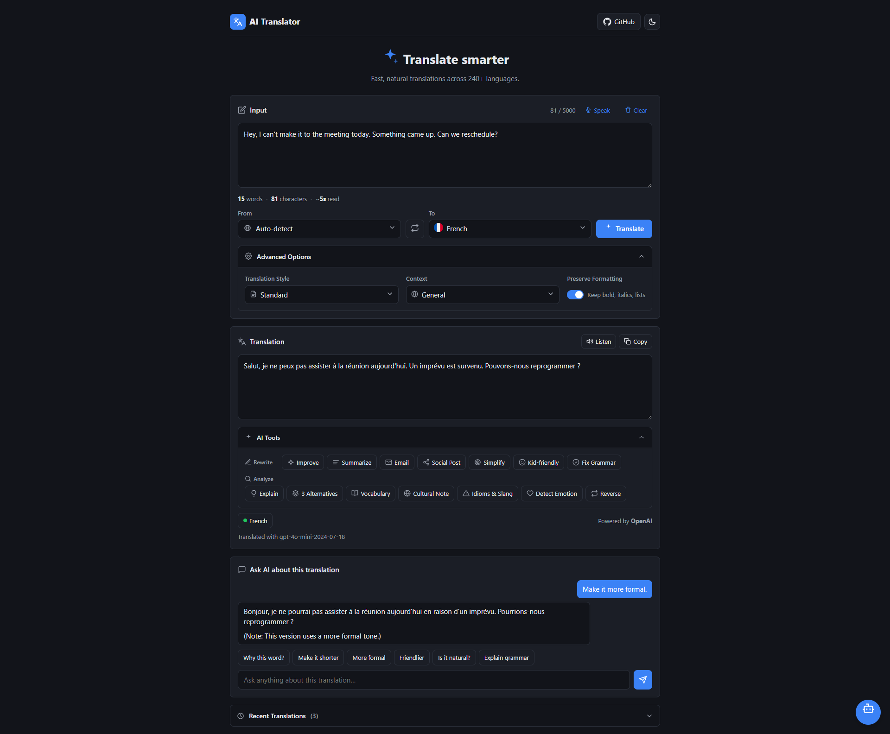
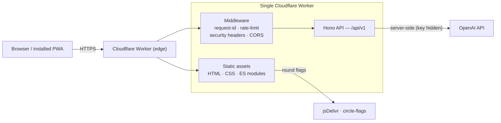
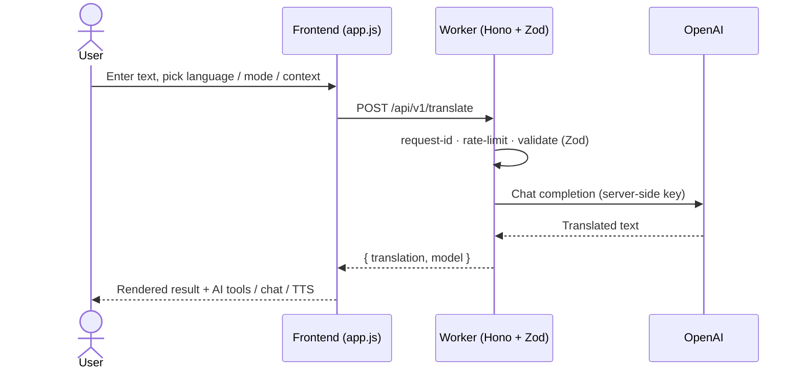

# AI Translator

[](https://github.com/MRaysa/AI-Translator/actions/workflows/ci.yml)


[](./LICENSE)

A full-stack **AI language studio** running entirely on **Cloudflare Workers**. It goes far beyond word-for-word translation — tone modes, domain contexts, an AI tool suite, a chat assistant, text-to-speech, and reverse-translation accuracy checks — across **240+ languages**, powered by **OpenAI**.

The frontend UI and the backend API both run inside a **single Cloudflare Worker** — one deploy, one origin, no servers to manage. The OpenAI key stays server-side and is never exposed to the browser.

🔗 **Live demo:** https://translator-app.aysasiddikameem3141.workers.dev



## 📸 Screenshots

<p align="center">
  
</p>

<p align="center"><em>More captures and a 20–30s demo GIF can be added to <a href="docs/screenshots/">docs/screenshots/</a> — see the <a href="docs/screenshots/README.md">capture guide</a>.</em></p>

## 🏗️ Architecture



### Sequence — a translation request



## ✨ Features

**Translation**

- 240+ languages with auto-detect, searchable pickers, and country flags
- 6 tone **modes**: Standard, Professional, Friendly, Academic, Social, Funny
- 7 domain **contexts**: General, Business, Technical, Legal, Medical, Travel, Education
- Preserve-formatting toggle (markdown, lists, line breaks)

**AI tools** (12) — one-click on any translation

- _Rewrite:_ Improve, Summarize, Email, Social Post, Simplify, Kid-friendly, Fix Grammar
- _Analyze:_ Explain, 3 Alternatives, Vocabulary, Cultural Note, Idioms & Slang, Detect Emotion, Reverse check (with similarity %)

**Assistants**

- **AI Chat** about a translation (follow-up questions, rewrites)
- **Lingo** — a floating AI chatbot assistant on every page
- **Listen** — text-to-speech in a natural voice (OpenAI TTS)

**Experience**

- Translation history + auto-saved draft (localStorage)
- Live word / character / reading-time stats
- Light / dark theme, responsive landing page, professional iconography

## 🧱 Tech stack

| Area       | Tech                     |
| ---------- | ------------------------ |
| Runtime    | Cloudflare Workers       |
| Framework  | [Hono](https://hono.dev) |
| Language   | JavaScript (ESM)         |
| AI         | OpenAI API (chat + TTS)  |
| Validation | Zod                      |
| Tests      | Vitest                   |
| Tooling    | Wrangler                 |

## 📁 Project structure

```
src/                      # Backend (Cloudflare Worker)
  index.js                Worker entry — Hono app, routes, middleware
  config.js               Env + defaults
  routes/                 translate · explain · speak · tools · chat · assistant
                          · modes · contexts · languages · models · health
  services/openai.js      OpenAI wrapper (translate, explain, runTool, chat, assistant, speak)
  middleware/             CORS + central error handler
  schemas/                Zod request validation
  lib/                    prompt builder · languages · modes · contexts · tools · logger

public/                   # Frontend (served by the Worker, native ES modules)
  index.html              Markup
  styles.css              Styles (light/dark themes)
  app.js                  Bootstrap — wires features & kicks off data loads
  js/
    dom.js                Cached element references
    state.js              Shared app state (single source of truth)
    ui.js                 toast · status · output · message-bubble helpers
    theme.js              Light/dark toggle
    scrollspy.js          Nav highlight on scroll
    input.js              Input stats + draft auto-save
    api.js                Typed client for the Worker API
    markdown.js           Minimal safe markdown renderer
    flags.js              Language → country-flag rendering
    icons.js              Inline SVG icon sets
    searchableSelect.js   Reusable searchable dropdown component
    translate.js          Core translate / swap / copy / listen
    languages.js          Loads modes, contexts & language pickers
    tools.js              12 AI tools + result panel
    chat.js               "Ask AI about this translation"
    assistant.js          Floating "Lingo" chatbot
    history.js            localStorage translation history

test/                     Vitest tests
scripts/list-models.js    Lists active OpenAI models for your key
```

### Frontend architecture

The frontend uses **native ES modules** — no bundler or build step. `app.js` is a thin
bootstrap; each concern lives in its own single-responsibility module under `public/js/`.
Shared state lives in `state.js`, DOM refs in `dom.js`, and every feature module exposes an
`init()` that wires its own events. The import graph is acyclic.

## 🚀 Getting started

```bash
npm install
```

Add your OpenAI key for local dev (git-ignored):

```
# .dev.vars
OPENAI_API_KEY=sk-...your key...
```

Run locally:

```bash
npm run dev        # http://localhost:8787
```

Run tests:

```bash
npm test
```

Check which models your key can use:

```bash
npm run list-models
```

## ☁️ Deploy to Cloudflare

```bash
npx wrangler login
npx wrangler secret put OPENAI_API_KEY   # production secret
npx wrangler deploy
# → https://translator-app.<account>.workers.dev
```

## 🔌 API

Endpoints are versioned under **`/api/v1`** (with `/api` kept as an alias).
Full reference with request/response schemas: **[docs/API.md](docs/API.md)**.

| Method | Path             | Purpose                                              |
| ------ | ---------------- | ---------------------------------------------------- |
| POST   | `/api/translate` | Translate text (mode, context, preserveFormatting)   |
| POST   | `/api/tools/run` | Run an AI tool (improve, summarize, alternatives, …) |
| GET    | `/api/tools`     | List available AI tools                              |
| POST   | `/api/explain`   | Explain a translation for a learner                  |
| POST   | `/api/chat`      | Ask follow-up questions about a translation          |
| POST   | `/api/assistant` | Standalone assistant chatbot (Lingo)                 |
| POST   | `/api/speak`     | Text-to-speech (MP3)                                 |
| GET    | `/api/languages` | Supported languages                                  |
| GET    | `/api/modes`     | Translation modes                                    |
| GET    | `/api/contexts`  | Domain contexts                                      |
| GET    | `/api/models`    | Active OpenAI models                                 |
| GET    | `/api/health`    | Liveness check                                       |

### Example

```bash
curl -X POST http://localhost:8787/api/translate \
  -H "Content-Type: application/json" \
  -d '{"text":"Good morning","targetLang":"bangla","mode":"friendly"}'
# → {"translation":"সুপ্রভাত!", "sourceLang":"auto", "targetLang":"bangla", ...}
```

Errors are returned as `{ "error": { "code", "message" } }`.

## ⚙️ Configuration

Non-secret defaults live in `wrangler.toml` under `[vars]` (`DEFAULT_MODEL`, `DEFAULT_TARGET_LANG`, `APP_VERSION`, `RATE_LIMIT`). Secrets (`OPENAI_API_KEY`) are set via `.dev.vars` locally or `wrangler secret put` in production.

## 📚 More

- [API reference](docs/API.md)
- [Changelog](CHANGELOG.md)
- [License](LICENSE) — MIT
